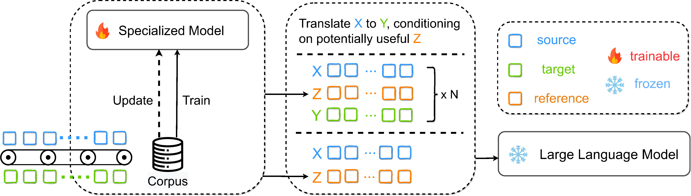
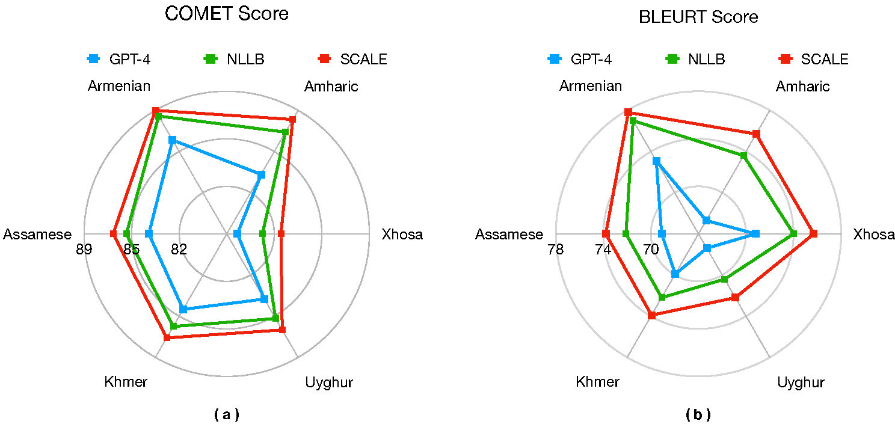
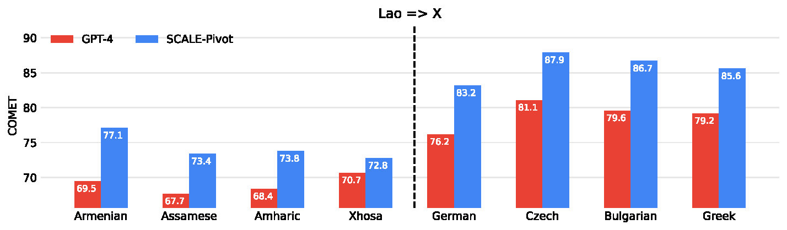
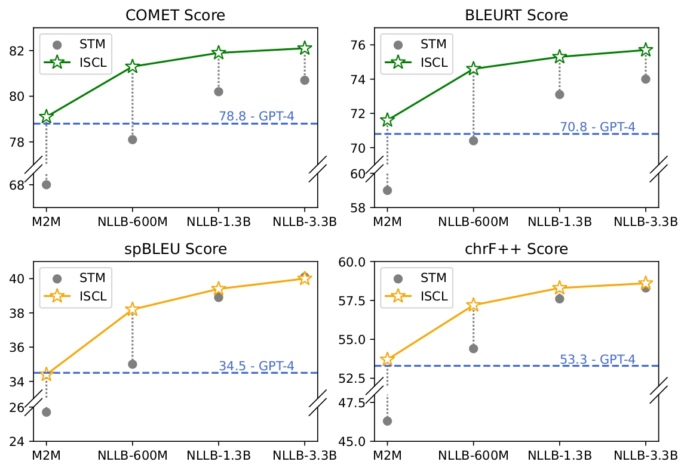

## SCALE: Synergized Collaboration of Asymmetric Language Translation Engines

This repository contains the code and the generated output for this paper: **SCALE: Synergized Collaboration of Asymmetric Language Translation Engines**. In this paper, we propose a framework called SCALE, which combines the Specialized Translation Model with Large Language Model to perform translation tasks.

<div align=center>

</div>

With SCALE, we achieved superior performance in the challenging low-resource setting, surpassing both few-shot GPT-4 and supervised NLLB model:
<div align=center>

</div>

We also show that within SCALE framework, LLM-based translation system could do translation in any language pairs with high-resource langauge as pivotal point:
<div align=center>

</div>

Considering the trade-off between speciallization and generalization of LLM and substantial computing cost for updating LLM, in SCALE, by fixing LLM and only updating small translation model, the overall performance could be greatly boosted:
<div align=center>

</div>

## Setup
```bash
pip install torch transformers datasets sacrebleu unbabel-comet
pip install git+https://github.com/lucadiliello/bleurt-pytorch.git
```
## Evaluation
We evalute our system with [COMET](https://unbabel.github.io/COMET/html/index.html), [BLEURT](https://github.com/google-research/bleurt), for completeness, we also include the results of [spBLEU and chrF++](https://github.com/mjpost/sacrebleu). 
For COMETKiwi, the checkpoint could be downloaded from [here](https://huggingface.co/Unbabel/wmt22-cometkiwi-da/tree/main).
To reproduce our results, for example in Table 1 of our paper, we refer to the following snippet:
```python
from evaluation import eval_translation
from datasets import load_dataset

src_lang = 'asm_Beng'
trg_lang = 'eng_Latn'
flores200 = load_dataset("facebook/flores","all")
src = [x[f"sentence_{src_lang}"] for x in flores200['devtest']]
refs = [x[f"sentence_{trg_lang}"] for x in flores200['devtest']]
hyps = [x.strip() for x in open(f"output/refinement/scale/{src_lang}2{trg_lang}.output")]
print(eval_translation(src,hyps,refs))
```

## Reproducibility
For the prompt we use, we refer to the `example` folder

For the model output, we refer to the `output` folder where we include the results of SCALE for **refinement**, **pivoting**, **upudating** and **multi-path-sampling**. We also include the results from GPT-3.5, GPT-4, Microsoft Translator, NLLB, XGLM and M2M100.

## STM Generation
For Supervised Translation Model(STM) doing translation, we use the following command:
```bash
src_lang=xho_Latn
trg_lang=eng_Latn
output_dir=temp

python translate_flores200_nllb.py \
    --src_lang ${src_lang} --trg_lang ${trg_lang} \
    --data_split devtest \
    --output_dir ${output_dir}/${src_lang}/${trg_lang}
```
